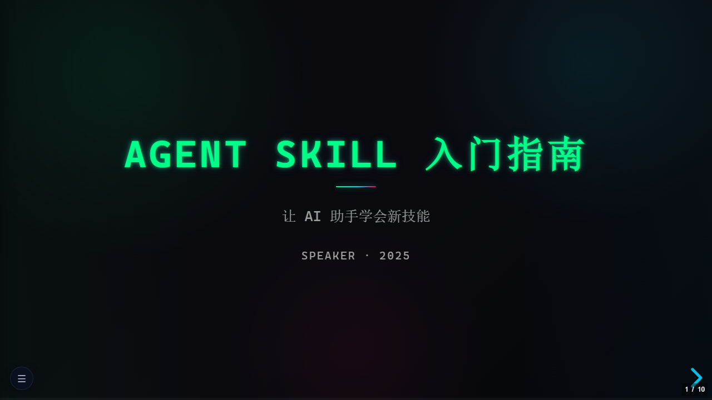

<p align="center">
  <h1 align="center">🎬 HTML Presentation Skill</h1>
  <p align="center">
    <em>AI Agent Skill · Topic / Document → Single-File HTML Presentation</em>
  </p>
</p>

<p align="center">
  <a href="LICENSE"></a>
  <a href="https://www.npmjs.com/package/@qaz1230sp/html-presentation"></a>
  <a href="https://www.npmjs.com/package/@qaz1230sp/html-presentation"></a>
  <a href="https://github.com/qaz1230sp/html-presentation-skill/stargazers"></a>
  <a href="CONTRIBUTING.md"></a>
  <a href="https://github.com/qaz1230sp/html-presentation-skill/issues"></a>
</p>

<p align="center">
  <a href="https://www.npmjs.com/package/@qaz1230sp/html-presentation"><b>📦 npm Package</b></a> &nbsp;|&nbsp;
  <a href="SKILL.md"><b>📄 SKILL.md</b></a> &nbsp;|&nbsp;
  <a href="https://qaz1230sp.github.io/html-presentation-skill/"><b>🌐 Live Demo</b></a> &nbsp;|&nbsp;
  <a href="CONTRIBUTING.md">🤝 Contribute</a> &nbsp;|&nbsp;
  <a href="CHANGELOG.md">📋 Changelog</a>
</p>

<details>
<summary>📋 Table of Contents</summary>

- [Why HTML Presentation Skill?](#why-html-presentation-skill)
- [Theme Gallery](#theme-gallery)
- [Quick Start](#quick-start)
- [Your First Presentation](#your-first-presentation)
- [Features](#features)
- [Themes Reference](#themes-reference)
- [Layouts Reference](#layouts-reference)
- [Charts Reference](#charts-reference)
- [Project Structure](#project-structure)
- [Requirements](#requirements)
- [Contributing](#contributing)
- [License](#license)

</details>

## Why HTML Presentation Skill?

Traditional slide tools force you into clicking-and-dragging workflows. AI can generate content, but without structure guidance, the result is generic and unstyled. HTML Presentation Skill bridges the gap: describe your topic in natural language or hand over a document, and the AI assembles a polished, single-file HTML deck using a battle-tested component library — 16 layouts, 8 chart types, 6 themes, all with composition rules that prevent the "AI slop" look.

No PowerPoint. No Figma. No build step. Just one `.html` file you can open anywhere.

## Theme Gallery

Six built-in themes — click any demo to see it live:

<table>
<tr>
<td align="center"><strong>Glassmorphism</strong><br/><sub>Frosted glass, gradient orbs</sub><br/><a href="https://qaz1230sp.github.io/html-presentation-skill/glassmorphism-demo.html"></a></td>
<td align="center"><strong>Apple Keynote</strong><br/><sub>Clean white, minimal</sub><br/><a href="https://qaz1230sp.github.io/html-presentation-skill/apple-keynote-demo.html"></a></td>
</tr>
<tr>
<td align="center"><strong>Cyberpunk</strong><br/><sub>Neon glow, dark</sub><br/><a href="https://qaz1230sp.github.io/html-presentation-skill/cyberpunk-demo.html"></a></td>
<td align="center"><strong>Gradient Story</strong><br/><sub>Warm gradients, dark</sub><br/><a href="https://qaz1230sp.github.io/html-presentation-skill/gradient-story-demo.html"></a></td>
</tr>
<tr>
<td align="center"><strong>Editorial</strong><br/><sub>Serif type, warm paper</sub><br/><a href="https://qaz1230sp.github.io/html-presentation-skill/editorial-demo.html"></a></td>
<td align="center"><strong>Luxury Minimal</strong><br/><sub>Gold accents, dark</sub><br/><a href="https://qaz1230sp.github.io/html-presentation-skill/luxury-minimal-demo.html"></a></td>
</tr>
</table>

## Quick Start

### Installation

Install the skill:
```bash
npx skills add qaz1230sp/html-presentation-skill
```

Or place this directory into your AI tool's skills folder manually:

```
~/.copilot/skills/html-presentation/
```

You can also install via the GitHub Copilot CLI skills management interface.

## Your First Presentation

Describe what you want in natural language:

```text
> 帮我做一个关于微服务架构的 PPT
```

```text
> Create a presentation about React best practices
```

```text
> Convert this PDF into a presentation: ./report.pdf
```

```text
> 把这份 Word 文档转成演示文稿
```

The AI reads SKILL.md, selects a theme, plans the slide sequence, assembles layouts from the component library, runs a 31-item quality checklist, and saves a single portable HTML file.

## Features

- **16 slide layouts** — title-hero, two-column, card-grid, comparison, code-showcase, flowchart, timeline, stats-dashboard, table, and more
- **8 chart presets** — bar, line, pie, radar, scatter, funnel, gauge, treemap (powered by [ECharts 5](https://echarts.apache.org/))
- **6 built-in themes** — from frosted glass to cyberpunk neon
- **Document conversion** — Markdown, PDF, Word (.docx), PowerPoint (.pptx) → slides
- **Single HTML file** — no build step, no server, open in any browser
- **Composition intelligence** — narrative arc templates, pacing rules, density limits prevent "AI slop"
- **Speaker notes** — press `S` for speaker view with notes, timer, and next-slide preview
- **Navigation sidebar** — collapsible slide nav for easy browsing
- **ink-graph integration** — auto-install for complex SVG diagrams (architecture, data-flow, sequence)
- **PDF export** — append `?print-pdf` to URL, then print to PDF
- **Slide numbers + progress bar** — configurable display

## Themes Reference

| Theme | Base | Style | Best For |
|-------|------|-------|----------|
| **Glassmorphism** | `white.min.css` | Frosted glass, gradient orbs, blur effects | Tech talks, product demos, SaaS |
| **Apple Keynote** | `white.min.css` | Clean white, system fonts, sharp shadows | Corporate, formal, investor decks |
| **Cyberpunk** | `black.min.css` | Neon glow, scanlines, terminal green | Gaming, tech community, hackathons |
| **Gradient Story** | `moon.min.css` | Warm gradients, storytelling flow | Tutorials, blog recaps, open-source |
| **Editorial** | `serif.min.css` | Serif type, warm paper tones | Documentation, research, content-heavy |
| **Luxury Minimal** | `black.min.css` | Gold accents, dark elegance | Executive briefings, premium events |

## Layouts Reference

| Layout | Slides | Best For |
|--------|--------|----------|
| `title-hero` | 1 | Opening slide with title, subtitle, speaker |
| `toc` | 1 | Table of contents (4 adaptive variants by item count) |
| `section-divider` | per chapter | Visual chapter transition |
| `two-column` | ∞ | Side-by-side content, text + code |
| `card-grid` | ≤2 | Feature sets, capability overviews (2-6 cards) |
| `comparison` | ≤2 | Before/after, pros/cons, good/bad |
| `bullet-points` | ∞ | Sequential talking points |
| `code-showcase` | ≤3 | Code explanation with annotations |
| `flowchart` | ≤2 | Linear process workflows (3-5 steps) |
| `timeline` | ≤2 | Roadmaps, version history |
| `stats-dashboard` | ≤2 | KPI summaries, metric highlights |
| `icon-grid` | ≤2 | Feature highlights with icons (6-9 items) |
| `quote-highlight` | ≤1 | Memorable quotes, design principles |
| `full-image` | ≤2 | Screenshots, architecture diagrams |
| `table` | ≤2 | Structured data comparison |
| `end-cta` | 1 | Closing slide with call-to-action |

## Charts Reference

| Chart | Best For |
|-------|----------|
| **Bar** | Rankings, comparisons, category data |
| **Line** | Trends over time, continuous data |
| **Pie** | Composition, market share, proportions |
| **Radar** | Multi-dimensional capability comparison |
| **Scatter** | Correlation, distribution patterns |
| **Funnel** | Conversion pipelines, sales stages |
| **Gauge** | Single KPI progress, completion status |
| **Treemap** | Hierarchical data, budget allocation |

## Project Structure

```text
html-presentation-skill/
├── SKILL.md                 # Main skill file (AI reads this)
├── package.json             # npm package config
├── README.md
├── LICENSE                  # MIT
├── CONTRIBUTING.md
├── CHANGELOG.md
├── components/
│   ├── boilerplate.md       # HTML template with reveal.js config
│   └── navigation.md        # Collapsible sidebar component
├── layouts/                 # 16 slide layout templates
│   ├── title-hero.md
│   ├── toc.md
│   ├── two-column.md
│   └── ...
├── charts/                  # 8 ECharts preset configs
│   ├── bar.md
│   ├── pie.md
│   └── ...
├── themes/                  # 6 complete CSS themes
│   ├── glassmorphism.md
│   ├── apple-keynote.md
│   └── ...
├── rules/
│   ├── composition.md       # Assembly & sequencing rules
│   ├── positioning.md       # Layout centering strategy
│   └── quality-checklist.md # 31-item quality gate
├── references/
│   └── library-reference.md # Quick lookup tables
├── scripts/
│   └── read_file.py         # Document reader (PDF, Word, PPT)
└── demos/                   # Live demo presentations
    ├── index.html           # Demo gallery page
    └── *.html               # Theme demo files
```

## Requirements

### Required
- An AI assistant that supports custom skills (Claude Code, GitHub Copilot CLI, Cursor, Windsurf, etc.)
- A modern browser for viewing presentations

### Optional
- Python 3.8+ with `pymupdf`, `python-docx`, `python-pptx` for document conversion
- [ink-graph](https://github.com/qaz1230sp/ink-graph) for complex SVG diagrams (auto-installed on demand)

## Contributing

Contributions are welcome — especially new themes, layouts, chart presets, and composition rules. See [CONTRIBUTING.md](CONTRIBUTING.md) for guidelines.

## Contributors

[](https://github.com/qaz1230sp/html-presentation-skill/graphs/contributors)

## License

[MIT](LICENSE) © qaz1230sp
